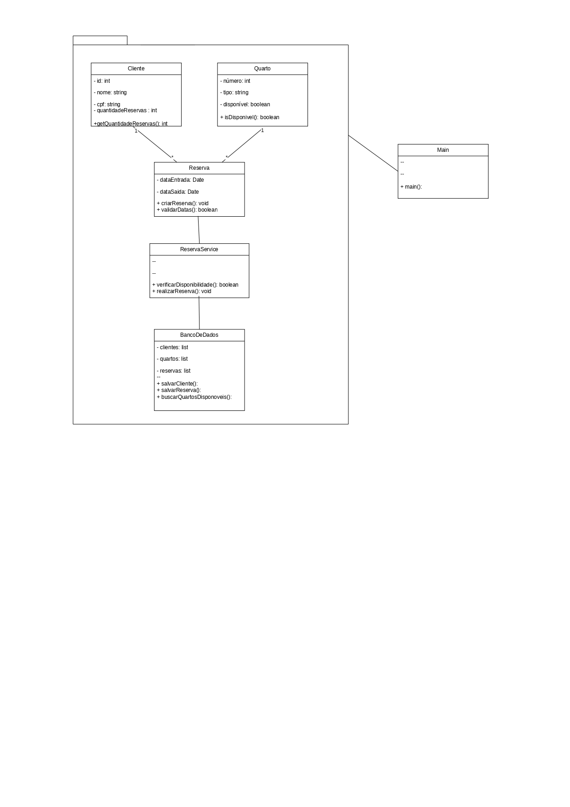

# 🏨 Projeto Hotel — Versão Beta

Sistema de gerenciamento de hotel desenvolvido em Java com foco em Programação Orientada a Objetos (POO). A versão beta expande o protótipo com tratamento de exceções, coleções integradas, fluxo completo de reservas e novas funcionalidades.

---

## 📁 Estrutura do Projeto

```
Projeto-Hotel/
├── model/          # Domínio + dados + exceções
│   ├── Client.java
│   ├── Quarto.java / QuartoSimples.java / QuartoLuxo.java
│   ├── Reserva.java
│   ├── BancodeDados.java
│   ├── ClienteException.java
│   └── ReservaException.java
├── controller/     # Lógica de negócio + controllers
│   ├── ReservaService.java
│   ├── ClienteController.java
│   ├── QuartoController.java
│   └── ReservaController.java
├── view/           # Interface com o usuário + entrada do sistema
│   ├── MenuView.java
│   └── Main.java
├── docs/           # Imagens e diagramas
└── README.md
```

---

## 🚀 Como Executar

1. Abra o terminal na pasta `Projeto-Hotel`.
2. Compile todos os arquivos Java:
   ```sh
   javac model/*.java controller/*.java view/*.java
   ```
3. Execute o sistema:
   ```sh
   java view.Main
   ```

---

## 🛠️ Funcionalidades

### Clientes
- Cadastro de cliente (com validação de CPF e nome)
- Listagem de todos os clientes
- Busca de cliente por CPF

### Quartos
- Adição de Quarto Simples (R$ 150,00/diária)
- Adição de Quarto Luxo (R$ 350,00/diária)
- Listagem de todos os quartos com status de disponibilidade

### Reservas
- Realização de reserva com seleção de quarto, cliente e datas (check-in / check-out)
- Cálculo automático de dias e valor total
- Cancelamento de reserva (libera o quarto automaticamente)
- Listagem de todas as reservas
- Listagem de reservas por cliente

---

## 🧠 Requisitos da Etapa 4 Atendidos

| Requisito | Como foi atendido |
|---|---|
| **Integração entre múltiplas classes** | Controllers orquestram model, service e repository em conjunto |
| **Uso de coleções (ArrayList)** | `BancodeDados` mantém `ArrayList<Client>`, `ArrayList<Quarto>` e `ArrayList<Reserva>` |
| **Tratamento de exceções (try-catch)** | `ClienteException` e `ReservaException` capturadas nos controllers com mensagens amigáveis |
| **Fluxo funcional completo** | entrada (MenuView) → processamento (Service/Controller) → saída (MenuView) |
| **Melhoria em relação ao protótipo** | Datas reais com LocalDate, cálculo de valor, cancelamento, validações e 10 opções de menu |

---

## 📚 Regras de Negócio

- Um cliente não pode ter mais de **3 reservas ativas** ao mesmo tempo
- A **data de saída** deve ser posterior à data de entrada
- Um quarto **ocupado** não pode ser reservado novamente
- Um CPF já cadastrado **não pode ser reutilizado**
- Ao cancelar uma reserva, o quarto é **liberado automaticamente**

---

## 📚 Tecnologias e Conceitos

- Java 8+
- Programação Orientada a Objetos
  - Encapsulamento, Herança e Polimorfismo
- Exceções customizadas (extends Exception)
- Coleções: ArrayList
- LocalDate / DateTimeFormatter (java.time)
- Arquitetura em camadas: model / exception / repository / service / controller / view

---

## 📋 Diagrama UML

<details>
<summary>Clique para expandir</summary>



</details>

---

## 👥 Autores

- Arthur Angelo
- Davi Almeida
- Maria Clara

---

## 📄 Observações

- O sistema é executado totalmente via linha de comando (CLI).
- Não utiliza banco de dados real — apenas listas em memória.
- Datas devem ser inseridas no formato **dd/MM/yyyy** (ex: 20/05/2026).
